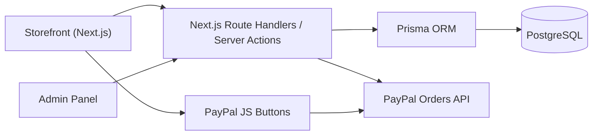

# Project Context

## Overview

A custom full-stack e-commerce website for two-way radios and accessories. The
visual design follows **rapidradios.ca** (clean, modern, conversion-focused
direct-to-consumer storefront), while the catalog depth and product structure
follow **twowayradiogear.com** (categories, industries, product series with
options/variants). The store includes a built-in admin panel so products can be
managed without touching code. Target scale is roughly 5,000 users on a single
Dockerized server.

## Reference sites

- UI / design reference: https://rapidradios.ca/
- Functionality / catalog reference: https://twowayradiogear.com/

## Locked-in decisions

- Build approach: Custom full-stack app (own code + own admin panel).
- Payments: PayPal.
- Currencies: CAD + USD, both stored explicitly per product (no live FX).
- Checkout: guest checkout + optional customer accounts with order history.
- Admin scope: products, variants/options, categories, industries (plus a
  light read-only orders list for fulfillment).
- Hosting: Debian machine with public IP (Docker) for production; Windows 11 for
  development. Everything containerized and portable.

## Tech stack

- Next.js (App Router) + TypeScript
- Tailwind CSS + shadcn/ui
- PostgreSQL + Prisma ORM
- Auth.js (NextAuth), credentials-based, roles `customer` / `admin`
- PayPal Server SDK (orders create/capture) + PayPal JS buttons
- Docker Compose (app + Postgres); Caddy reverse proxy for TLS in production

## Architecture

## Data model (Prisma)

- `User` — role, email, passwordHash, name
- `Product` — name, slug, brand, description, images[], status, isNewArrival,
  isBestSeller, priceCadCents, priceUsdCents, saleCadCents?, saleUsdCents?
- `ProductOption` + `ProductVariant` — option types (e.g. model/color),
  per-variant price overrides, SKU, stock
- `Category` and `Industry` — each many-to-many with `Product`
- `Cart` / `CartItem` — cookie-based guest cart, merged into user on login
- `Order` / `OrderItem` / `Address` — currency stored on order; PayPal capture id
  and status
- `Review` — testimonials shown on the storefront

Multi-currency approach: store explicit CAD and USD prices per product/variant.
The user selects a currency; the PayPal order is created in that currency.

## Functionality

### Storefront (customer-facing)

- Conversion-focused homepage: hero + CTA, trust badges, featured tabs
  (New Arrivals / Best Sellers), Shop by Category, Shop by Industry,
  testimonials, partners strip, newsletter signup.
- Catalog browsing: category pages, industry pages, product grids with sorting
  and basic filtering.
- Product detail: image gallery, rich description, variant/option selectors,
  live price updates, stock/availability state.
- Product search across the catalog.
- Multi-currency display (CAD / USD) with currency switcher.
- Sale pricing (compare-at / "Save $X").
- Cart: add/update/remove, quantity changes, slide-out drawer + cart page,
  persistent guest cart that merges into the account on login.
- Checkout: guest or logged-in, address capture, order summary, PayPal payment
  (create + capture), order confirmation page.
- Customer accounts: register, login, logout, profile, order history.
- Static/support pages: Contact, Shipping Policy, About.
- Responsive, mobile-first design.

### Admin (store management, auth-protected)

- Secure admin login (admin role), separate from customer accounts.
- Product management: create/edit/delete, image upload/management, descriptions,
  CAD + USD prices and sale prices, New Arrival / Best Seller flags, status
  (active/draft).
- Variants & options: option types, per-variant price overrides, SKU, stock.
- Category and Industry management and product assignment.
- Read-only orders list with order details and status.

### Platform / non-functional

- Sized for ~5k users on a single Dockerized server.
- Dockerized for Windows 11 dev and Debian public-IP production (Caddy auto-TLS).
- Seed data so the store looks complete on first run.
- Environment-based config (PayPal keys, DB URL, auth secret) via `.env`.

## Environments

- Development: Windows 11 via `docker compose up` (app + Postgres).
- Production: Debian host with public IP, Docker + Caddy reverse proxy with
  automatic TLS.

## Open notes / defaults (changeable later)

- PayPal sandbox keys until live credentials are provided.
- Shipping = flat-rate placeholder; real rates can be added later.
- Taxes left as a configurable placeholder.
